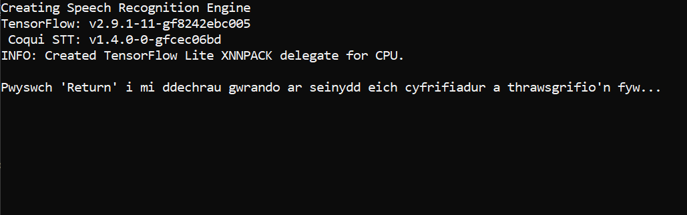

# Trawsgrifiwr Byw

Mae'r meddalwedd yma yn ceisio drawsgrifio'n fyw unrhyw leferydd Cymraeg a ddaw drwy seinydd eich cyfrifiadur Windows. 
Defnyddir modelau adnabod lleferydd gan y meddalwedd yn lleol ar eich peiriant, sy'n rhedeg yn hwylus a gyflym ar 
galedwedd arferol eich cyfrifiadur. Mae angen gwella ac hyfforddi rhagor ar y modelau. 

# Realtime Welsh language Transcriber

The code in this repository allows a locally installed speech recognition engine to transcribe any speech from 
the loudspeaker of your Windows PC. A Welsh language speech recognition model is already included with the 
sofware that that is small in size, can run on your machine's conventional hardware, and still be fast enough.
Further training and improving of the models is still required. 

